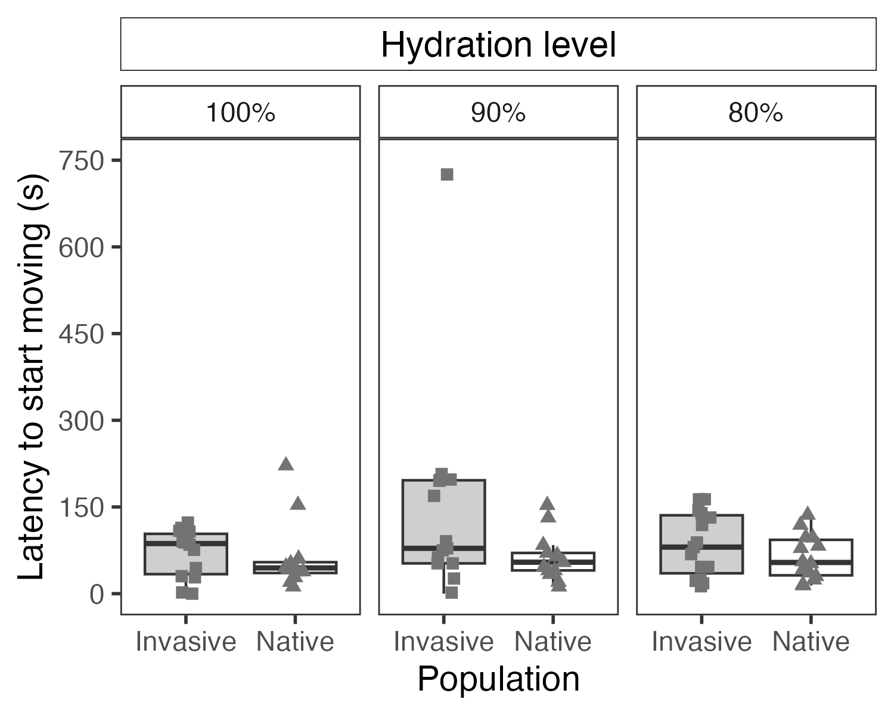

## Dehydration Behavior in Toads 🐸




This is a small portfolio showcasing the figures produced for [Challenges of dehydration result in a behavioral shift in invasive toads](https://link.springer.com/article/10.1007/s00265-020-02866-5). This project studied the behavior patterns of invasive and native toad species in response to dehydration. [Figure 1](figures/Fig1_MovementLatency.png) is an example. To see all figures and legends, check [this page](figures/portfolio.md).

The portfolio can be used as a real-life example teaching tool to cover how publication quality figures can be assembled in R. The examples go from basic elements of [The Grammar of Graphics](https://www.amazon.com/Grammar-Graphics-Statistics-Computing/dp/0387245448/ref=as_li_ss_tl) such as layers of aesthetic mapping and geoms, to more advanced concepts such as the structure of graphic objects (grobs). 

Below is an in-depth explanation of the code structured as an introduction to graphing in R.

<br>
<br>

### Introduction to Graphing with ggplot2 in R

#### Objective
In this lesson, we'll explore how to create a detailed plot using `ggplot2` in R. We'll start with the basics and gradually introduce more advanced concepts.

#### The Data
We'll be working with a dataset named `All`, which contains information about different populations and their movement latency under various conditions.

---

#### 1. Setting up the Base Layer

```R
MovementLatency <- ggplot(data = All, mapping = aes(x = population, y = Movementlatency))
```

**ggplot()**: This function initializes a ggplot object. It's the foundation upon which we'll build our plot.

**data = All**: Specifies the dataset we're using.

**mapping = aes(x = population, y = Movementlatency)**: This is an aesthetic mapping. It tells ggplot what variables to use on the x and y axes.

#### 2. Adding Geometric Objects (Geoms)

```R
geom_boxplot(mapping = aes(fill = population), outlier.shape = NA) +
geom_point(mapping = aes(shape = population), color = "#737373", position = position_jitter(width = 0.1), size = 2)
```
**geom_boxplot()**: **Adds a boxplot to the graph. The fill aesthetic is mapped to the population variable, meaning different populations will have different colors.

**outlier.shape = NA**: **This removes outliers from the boxplot.

**geom_point()**: **Adds points to the graph. Each point represents an observation in the dataset.

**color = "#737373"**: **Sets the color of the points.

**position = position_jitter(width = 0.1)**: **Adds a bit of random noise to the position of the points to prevent overlap.

**size = 2**: **Sets the size of the points.

#### 3. Customizing the Appearance

```R
theme_classic(base_size = Size) +
labs(x = "Population", y = "Latency to start moving (s)") +
theme_bw(base_size = Size) +
theme(panel.background = element_rect(fill = NA),
      panel.grid = element_blank(),
      strip.background = element_rect(fill = "white"))
```

**theme_classic()**: **Applies a classic theme to the plot.

**labs()**: **Used to customize or add labels to the plot.

**theme_bw()**: **Applies a black-and-white theme.

**theme()**: **Further customization of the plot's appearance.

#### 4. Faceting, Scales, and Guides

```R
facet_grid(cols = vars(Condition)) +
scale_y_continuous(breaks = c(0, 150, 300, 450, 600, 750), limits = c(0, 750)) +
scale_shape_manual(values = c(15, 17)) + 
scale_fill_manual(values = c("#cfcfcf", "#ffffff")) +
guides(shape = FALSE, fill = FALSE)
```


**facet_grid()**: **Splits the plot into multiple plots based on the Condition variable.

**scale_y_continuous()**: **Customizes the y-axis scale.

**scale_shape_manual() and scale_fill_manual()**: **Manually set the shapes and fills used in the plot.

**guides()**: **Controls the display of legends.

#### 5. Finalizing and Saving the Plot

```R
gridTitle <- ggplotGrob(MovementLatency)
grid.newpage()
grid.draw(gridTitle)
ggsave("Fig1_MovementLatency.pdf", gridTitle, width = 5, height = 4)
```

**ggplotGrob()**: **Converts the ggplot object to a grob (graphical object) which allows for more detailed customization.

**grid.newpage() and grid.draw()**: **Functions from the grid package used to draw the plot.

**ggsave()**: **Saves the plot to a file.

#### Conclusion
With ggplot2, you can create detailed and customized plots in R. By understanding the logic behind elements, layers, geoms, facets, scales, and themes, you can craft a wide variety of visualizations tailored to your data.

### Contact 📞
For collaboration or inquiries, [visit my homepage](https://github.com/YourUsername).
