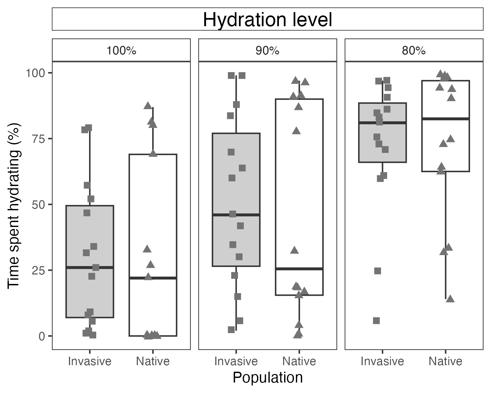
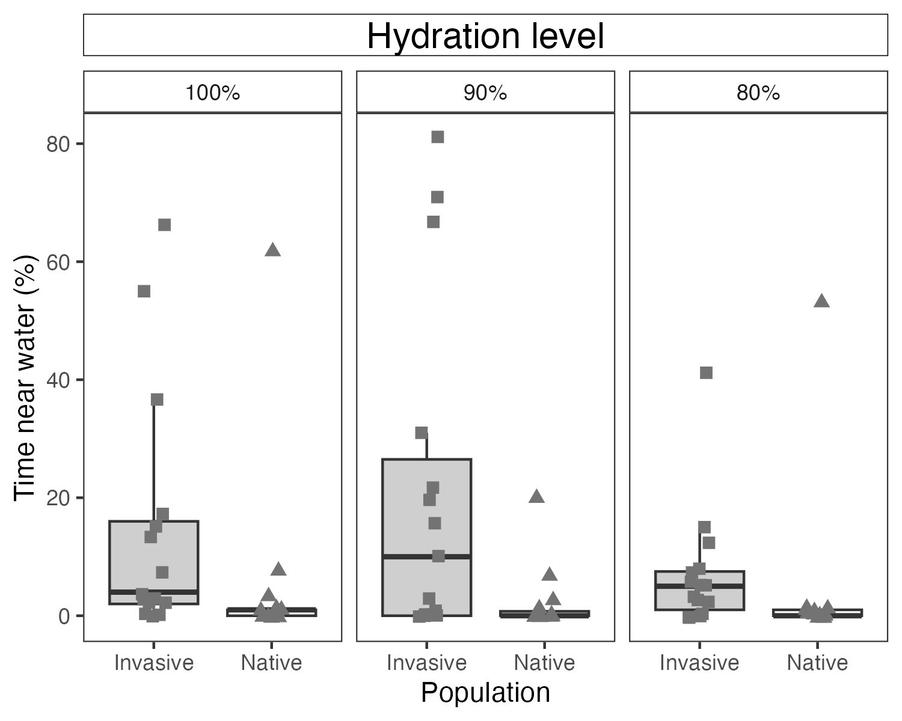
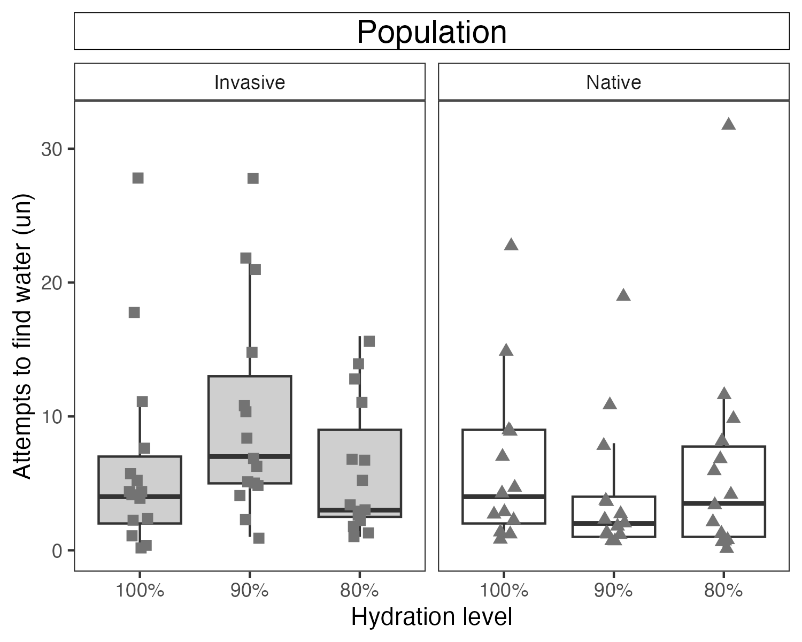
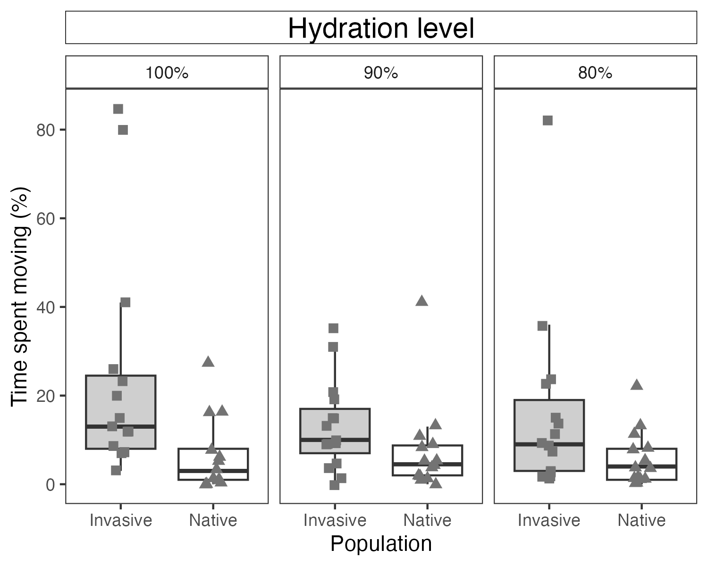
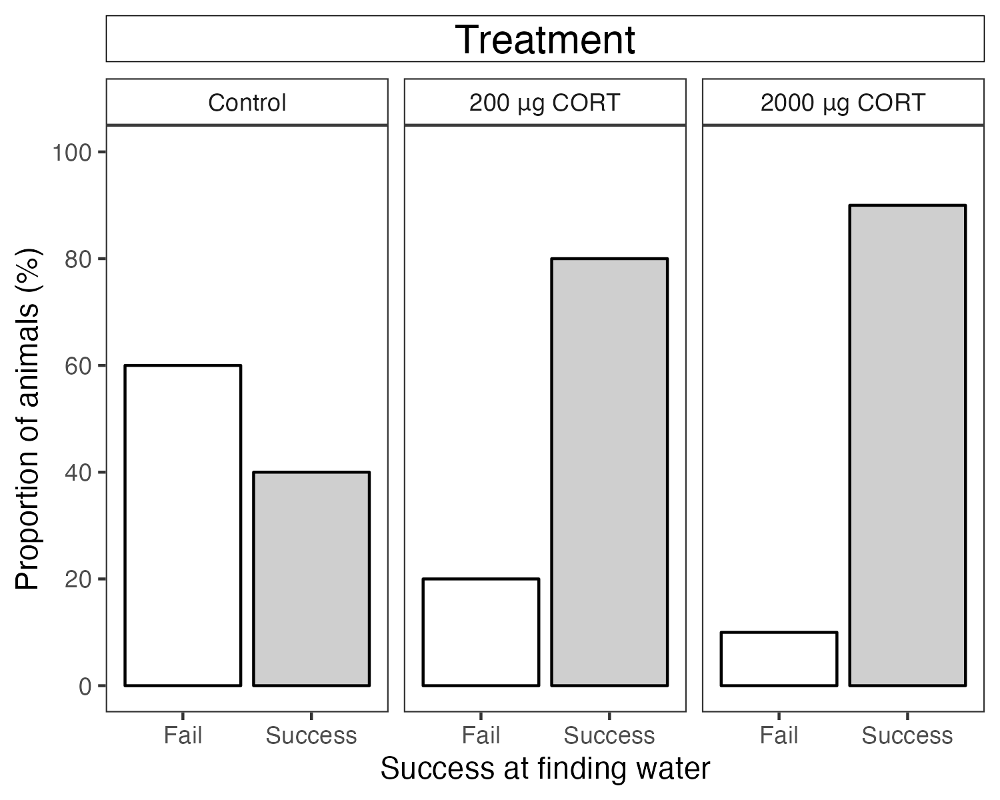

**Fig. 1** Latency to start moving for native and invasive populations at different hydration levels (80, 90, and 100%). Squares (invasive population, Cape Town) and triangles (native population, Durban) represent how long each animal took to start moving, in seconds, once released into the labyrinth. Boxplots display the median, 10th, 25th, 75th, and 90th quantiles of observations. Within all hydration levels, animals from the invasive population took significantly longer to move than their native counterparts. (N = 40/41 for native, N = 44/45 for invasive; one outlier was removed from the graph but not from the analysis: latency to move = 2663 seconds, from the native population, 100% hydration level; one individual from the invasive population had the first hour of the video corrupted and was removed from this metric)

**Fig. 2** Time spent hydrating for native and invasive populations at different hydration levels (80, 90, and 100%). Squares (invasive population) and triangles (native population) represent individual observations of the proportion of a trial each animal spent on a water-soaked cotton ball. Boxplots display the median, 10th, 25th, 75th, and 90th quantiles of observations. Dehydrated animals spend more time on a water source. For both populations, the proportion of hydration time is inversely proportional to hydration levels. Controls (100% hydrated) spent the least proportion of time directly on top of the water source. Within each condition, no differences between populations was found (N = 41/41 for native, N = 44/45 for invasive; one individual from the invasive population had the last 10 h of the video corrupted and was removed from this metric)

**Fig. 3** Time spent within the arm containing the water for native and invasive populations at different hydration levels (80, 90 and 100%). Squares (invasive population) and triangles (native population) represent the proportion of time each animal spent next to a water source, in the arm where the water source was present, but not directly on top of the water-soaked cotton ball. Boxplots display the median, 10th, 25th, 75th, and 90th quantiles of observations. Within each hydration level condition, animals from the invasive population spent more time near a water source than their native counterparts; this trend was mostly prominent within the 90% hydration condition (N = 41/41 for native, N = 44/45 for invasive; one individual from the invasive population had the last 10 h of the video corrupted and was removed from this metric)

**Fig. 4** Total of attempts to find water at different hydration levels (80, 90, and 100%) for native and invasive populations. Squares (invasive population) and triangles (native population) represent the number of times an individual entered an arm of the labyrinth: attempts to find water. This metric was only calculated for trials in which an animal successfully found water (N = 37/41 for native, N = 44/45 for invasive fulfilled the criteria). Boxplots display the median, 10th, 25th, 75th, and 90th quantiles of observations. Animals at intermediate hydration levels differ in the number of attempts to find water.

**Fig. 5** Time spent moving for native and invasive populations at different hydration levels (80, 90, and 100%). Boxplots display the median, 10th, 25th, 75th, and 90th quantiles of observations. Within all hydration levels, animals from the invasive population spent a greater proportion of total trial time active (N = 41/41 for native, N = 44/45 for invasive; one individual from the invasive population had the last 10 h of the video corrupted and was removed from this metric).

**Fig. 7** Proportion of fully hydrated toads that fail and succeed at finding water after treatments (sesame oil, 200ug and 2000ug of CORT). Acute CORT treatment increases success in finding water in guttural toads, Sclerophrys gutturalis.
